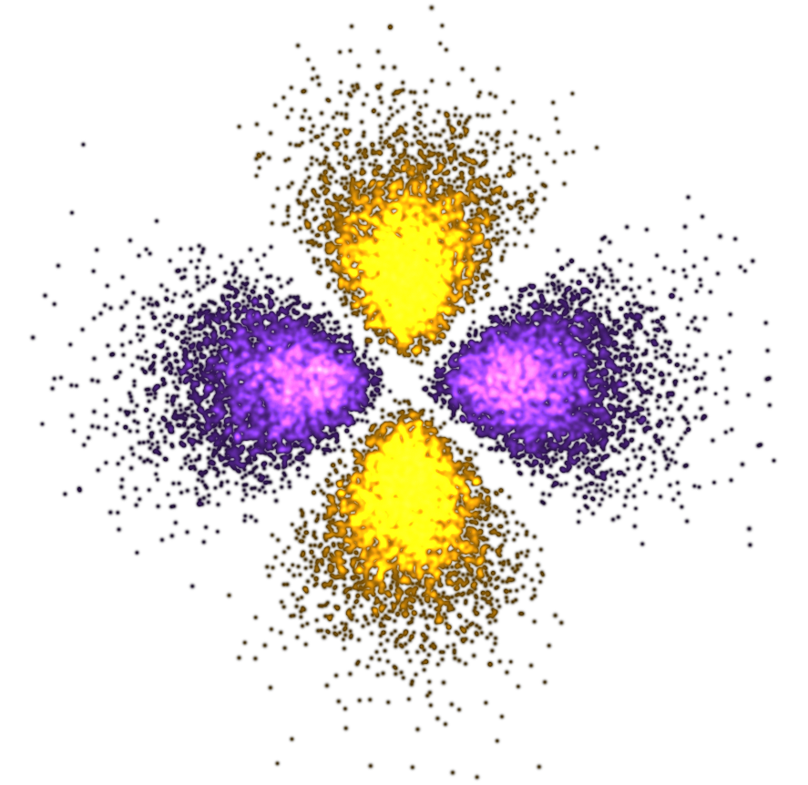

The Knepp Lab investigates problems with electronic-structure theory and molecular dynamics. We use theory and simulation to understand how structure, dynamics, and external stimuli influence the properties of molecular and materials systems. Current projects include the rational design of molecular photoswitches, excited- and triplet-state dynamics, charge transport and thermal effects in glasses and crystalline materials, and interfacial behavior in functional coatings.

